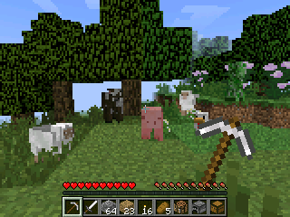

# NumBlocks

> This repository mirrors the `games/numblocks` folder of NumPlay and is updated automatically: changes go to NumPlay, and edits made here are overwritten. Its releases are NumPlay's: the same `NumBlocks.nwa`, from the NumPlay release of that version.

Mine, craft and survive on your NumWorks calculator, in a world like Minecraft 1.8.

- **A real 1.8 world:** the same biomes, hills, caves, lakes and trees as Minecraft 1.8.8, for any seed. Or a superflat world to build on.
- **Survival:** health, hunger, day and night, zombies, skeletons, creepers and spiders, and pigs, cows, sheep and chickens.
- **Weather:** rain, snow and thunderstorms with lightning, as often as in 1.8.
- **Crafting:** 129 items and all their 1.8 recipes, a furnace, chests, tools that wear out, armor.
- **Fishing:** cast, wait for the bite, reel in fish, junk or treasure.
- **Building:** 250 kinds of blocks, doors, beds to sleep through the night, stairs, torches that light up caves, flowing water and lava, farms that grow.
- **Fire:** light it with flint and steel. It spreads and burns wood, leaves and wool, like in 1.8.
- **Creative mode:** fly, every block and item, break things at once, and search for any block.
- **Commands:** /gamemode, /give, /time, /weather, /tp and more, with cheats on (Allow Cheats, or Open to LAN).
- **Your worlds:** keep several, give them names, and they save as you play and when you quit. A copy also goes into `numblocks_saves.py`, so installing the game again doesn't erase them.

## Controls

| Key | What it does |
| --- | --- |
| Arrows | Look around |
| , π √ x² | Walk forward, left, back, right (like W, A, S, D) |
| shift | Jump (twice in Creative: fly) |
| alpha | Sneak |
| ⌫ | Sprint (or press forward twice) |
| OK | Mine, attack (like the left mouse button) |
| Back | Place, use, eat (like the right mouse button) |
| var | Inventory |
| 1 to 9 | Pick a hotbar slot |
| x,n,t | Drop the item |
| log | Pick the block you look at |
| × | Chat |
| ÷ | Type a command (toolbox finishes words) |
| ans | Pause |
| Home | Save and quit |

You can change these keys in Options, then Controls. In the inventory, the arrows move between slots, OK picks up or puts down, EXE takes or leaves one, and shift with OK moves a whole stack. To spread a stack, hold OK and move over the slots: it splits evenly when you let go (hold EXE to drop one in each). In Creative, the Search Items tab finds blocks as you type, and shift with up or down jumps to the top or bottom of a tab. The game shows these keys the first time you open it, and again from Options, then Controls.

## Get it

It comes inside [NumPlay](https://github.com/Mason363/NumPlay), or on its own as `NumBlocks.nwa` from the [latest release](https://github.com/Mason363/NumBlocks/releases/latest).

## Credits

Inspired by Minecraft, but not affiliated with Mojang or Microsoft. Go play the real Minecraft and support the people who made it! The textures, the font and the screens come from Minecraft 1.8.8, and the world is made the way Minecraft 1.8.8 makes it.

Also try [Numcraft](https://github.com/yannis300307/NumcraftRust) by yannis300307, the first Minecraft-like game for the NumWorks.

Made by Mason Chen as part of NumPlay.

## License

The game's code is licensed under the GNU General Public License v3.0: see the `LICENSE` file at the root of the repository. The textures, font and screens come from Minecraft 1.8.8 and belong to Mojang: they are not covered (see Credits).
